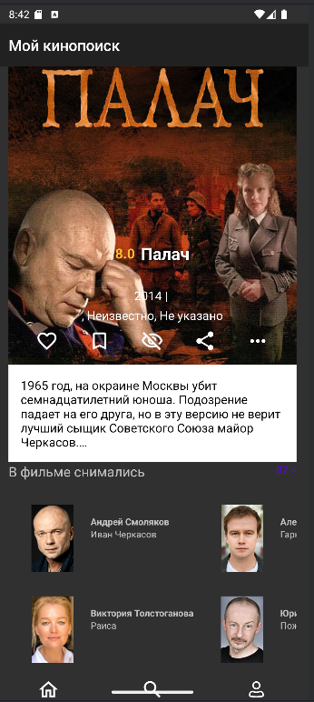
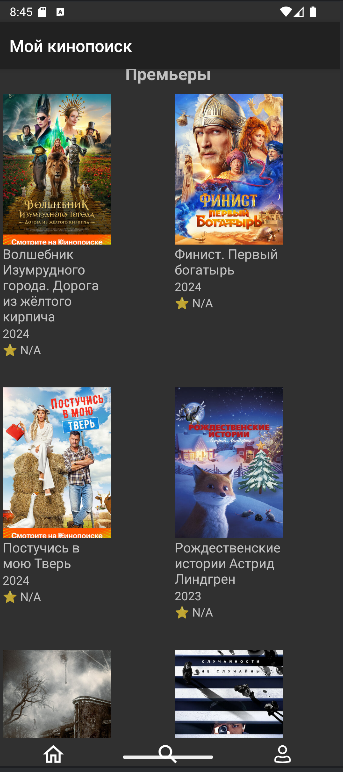
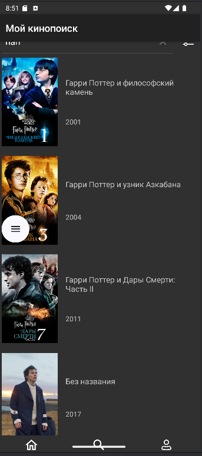
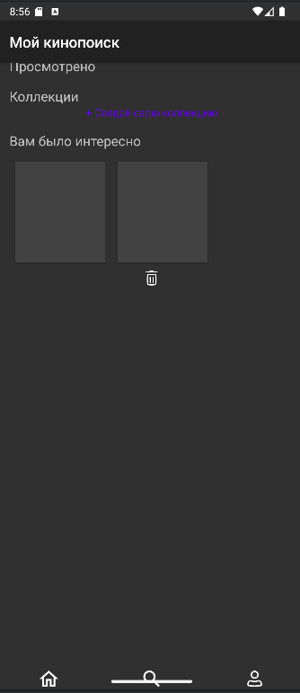

# 🎬 SkillCinema App

Мобильное Android-приложение в стиле КиноПоиска: позволяет просматривать фильмы, актёров, использовать фильтры, сохранять в избранное и многое другое.

> 📱 Учебный проект в рамках курса **«Android-разработчик. Уровень 1» от Skillbox**

---

## 🚀 Функциональность

- Поиск фильмов по названию
- Просмотр карточки фильма (актеры, рейтинг, описание)
- Галерея фото по категориям (со съёмок, постеры и др.)
- Список актёров и съёмочной группы
- Добавление в «Избранное», «Посмотрю позже»
- Хранение данных в локальной базе (Room)
- Навигация между экранами с сохранением состояния
- Firebase интеграция

---

## 🛠 Используемые технологии

- **Язык:** Kotlin
- **UI:** Jetpack Compose, XML layouts
- **Архитектура:** MVVM
- **Навигация:** Jetpack Navigation
- **Сеть:** Retrofit, REST API (https://kinopoiskapiunofficial.tech)
- **База данных:** Room, SQLite
- **Асинхронность:** Coroutines, Flow
- **DI:** Dagger/Hilt
- **Прочее:** Firebase, Glide, RecyclerView

---

## 🖼️ Скриншоты

| Главный экран | Карточка фильма | Фильмы выбранного раздела | Экран поиска | Профиль |
|  |  |  |  |  |


---

## ⚙️ Установка

1. Клонируйте проект:
   ```bash
   git clone https://github.com/Aleks-Mark-Dzr/final_android_lvl1.git
